### Bugs Discovered
#### Solved Bugs

1. Ingredients list/ method
  * When adding a recipe, I needed to add a list of ingredients and a method list.
  Each list needed to have a way to add or remove an item. When I originally used a 
  javascript funtion to achieve this, it would return a blank array to the database. 
  * To solve this I altered the python code to request.form.getlist, enabling the 
  complete list of ingreinent/method steps to appear.

2. Reicpe list 
  * When I first created a set of recipes, only 1 would appear on the recipe page. 
  It would not itterate through the loop and show all recipes in the database. 
  * To solve this I found a discrepancy in the name of the database that the loop 
  was searching. Instead of being named recipes, I had called it recipe. By adding 
  the s it was able to search the database successfully.

3. User access to site maintenance
  * Users had access to the management section of the site, where an admin can 
  add/edit/delete cuisines and users.
  * To solve this I added a conditional startement to the navbar, only allowing 
  administrators to access the pages at all.

4. Modal pop up windows
  * The modal pop up window to confirm an action would not appear.
  * To solve this I added the initialsation jquery code inside the document.ready 
  function.

5. Search recipes
  * After seaching through the recipes, the page would reset at the top, meaning 
  that the user needed to scroll dow to see their search results.
  * To solve this I created a dedicated recipe page with the searchbar at the top
  of the page.

6. Recipe layout
  * When multipe recipes were pulled from the database, they would stack vertically
   rather than horizintally as intended. 
  * To solve this I repositioned the for loop to inside the row. 

7. Delete confirmation modals
  * Each delete confirmation modal does not target the correct item. The first item
   (e.g. card) on the page, located in the top left corner, is deleted instead.
  * I added a funtion to javascript that could be called whenever I needed a delete 
  modal. 

8. Dietary requirement edit
  * When editing a recipe, the "spicy" dietary requirement would not appear, even if 
  the field was turned on in the database. It would then update incorrectly.
  * I discovered one fo the variables in the edit_recipe.html code was set to vegan
  and changed it to spicy. 

#### Remaining Bugs

1. Edit recipe ingredients/ method
  *  While editing a recipe, the instructions list add button will 
    add as many input fields as are already pressent. All of these input 
    fields must be filled or all removed. The same occurance happens for 
    the method input.

2. Edit user password
  * When editing user details I would like to leave the password unchanged. 
  But when te update has been confirmed, the password comes back as either 
  null or blank. 

### Validator Tests
#### All html Pages
  * W3C HTML Validator - Other than errors due to jinja syntax, no issues.

#### style.css
  * W3C CSS Validator - Congratulations, no error found!

#### script.js
  * JSHint Code Tester - There are 7 functions in this file. No warnings or undefined variables.

#### app.py
  * PEP8 Python Validator - All right.

### Manual Testing

1. Register
  * New users add a username and password to the input fields
  * Username and password(hashed) saved in the database, user lgged in to site
  * Result: pass

2. Existing user button
  * User with existing details clicks login button at the bottom of the page
  * User taken to login page to sign in
  * Result: pass

3. Register flash message
  * New users adds a username and password and confirms the register
  * Message of successful registry flashes up
  * Result: pass
  
4. Login
  * Existing users add a username and password to the input fields
  * User logged into site, to the profile page
  * Result: pass

5. New user button
  * New user clicks register account button at the bottom of the page
  * User taken to register page to register
  * Result: pass

6. Login flash message
  * User adds a username and password and confirms login
  * Message of successful login flashes up
  * Result: pass

7. Navbar
  * Click on each button in the bar
  * Takes the user to the appropriate page
  * Result: pass

8. Restricted navbar access (logged out)
  * When logged out, the user cannot access all pages/buttons
  * Only home, cookare, recipes, login and register available
  * Result: pass

9. Restricted navbar access (user logged in)
  * When logged in, the user cannot access all pages/buttons
  * Only home, cookare, recipes, add recipe, profile ad log out available
  * Result: pass

10. Unrestricted navbar access (Admin logged in)
  * When logged in, the administrator can access all pages/buttons
  * All pages/buttons available e.g. manage
  * Result: pass

11. Footer
  * Click social media buttons
  * Each button creates a new tab with the appropriate website
  * Result: pass

12. Homepage
  * Click any of the website feature links
  * The corresponding page appears
  * Result: pass

13. Homepage profile button
  * When logged in, the button will take you to you profile page
  * When logged out, the button will take you to the login page
  * Result: pass

14. Cookware
  * Display all cookware items present in the database
  * Result: pass

15. Add cookware
  * Click button (available to admin) to bring up the add cookware page
  * Input all required fields and confirm to add an item to the database
  * Click cancel to stop and return to cookware page
  * Result: pass

16. Recipes
  * Display all recipes present in the database
  * Result: pass

17. Recipe search
  * Enter enquiry into the search bar and click search button
  * Shows recipes based on recipe name or cuisine name
  * Result: pass

18. Recipe search reset
  * Click on the reset button in the search bar
  * Shows all recipes in the database
  * Result: pass

19. View recipe 
  * Click full recipe button  
  * Reveals dedicated recipe page
  * Result: pass

20. Recipe Page
  * Shows information about the selected recipe
  * Vegetarian/vegan/spicy indicators differ depending on the status of that feature
  * Result: pass

21. Add recipe 
  * Input fields are all required
  * Cuisine dropdown active, contains all cuisines in the database 
  * Can add or remove items to the ingregients/method sections
  * Click add recipe to confirm
  * Click cancel to return to recipe page
  * Result: pass

22. Profile page 
  * Shows all recipes created by the user
  * If user is admin, all recipes are shown 
  * Full recipe button links to dedicated page
  * Edit button links to edit recipe page
  * Delete button removes recipe from database
  * Result: pass

23. Edit recipe 
  * Input fields fill with current information about the recipe
  * Click edit recipe button confirms changes
  * Click cancel button to return to profile page
  * Result: pass

24. Cuisines
  * Display all cuisines present in the database
  * Click edit reveals edit cuisine page
  * Click delete to remove cuisine from database
  * Result: pass

25. Add cuisine
  * Click button to bring up the add cuisine page
  * Input all required fields and confirm to add an item to the database
  * Click cancel to stop and return to cuisine page
  * Result: pass

26. Edit cuisine 
  * Input field fills with current information about the cuisine
  * Click edit cuisine button confirms changes
  * Click cancel button to return to cuisine page
  * Result: pass

27. Users
  * Display all users present in the database
  * Click edit reveals edit user page
  * Click delete to remove user from database
  * Result: pass

28. Edit user 
  * Input fields fill with current information about the user
  * Click edit user button confirms changes
  * Click cancel button to return to user page
  * Result: pass

29. Log out 
  * Click log out button
  * Return user to log in page
  * Removes user from session cookie
  * Result: pass

### User Story Tests
#### Experienced with cooking:
1.	As someone with cooking experience, I am looking for a wide range of recipes from a number of varying cuisines. 
  * To address this I have created some users and under their name added around 30 recipes. 
  * 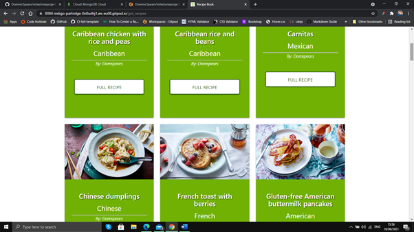

2.	As someone with cooking experience, I want a search bar or filter to narrow down the available results and make it easier to find specific recipes.
  * To address this I added a searchbar to the recip page that can search the name or cuisine of each recipe.
  * 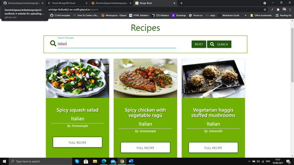

3.	As someone with cooking experience, I want to know if a meal is suitable for vegetarians, vegans or has any other notable traits.
  * To address this, on the view recipe page, I added dietary requirement indicators that say whether a meal is vegetarian, vegan or spicy.
  * 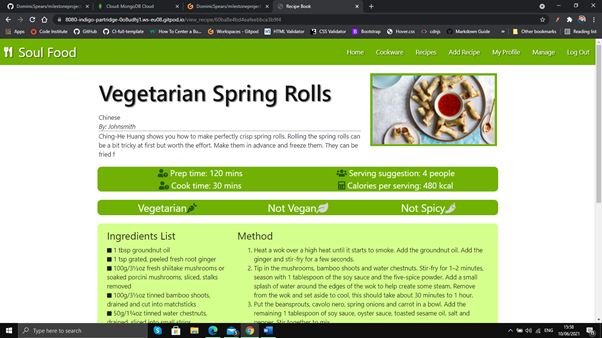

4.	As someone with cooking experience, I am very conscious about what I eat and want to know how many calories are contained in each serving. 
  * To address this, on the view recipe page, I have added recipe information including a calorie count per serving.
  * 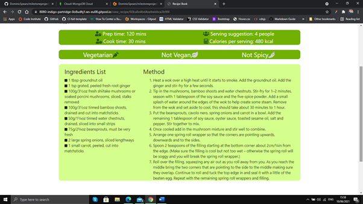

#### Inexperienced with cooking:
1.	As someone new to cooking, I want an ingredients list that clearly states each ingredient paired with the amount required.
  * To address this, on the view recipe page, I added a unordered list of all ingredients for each inividual recipe.
  * 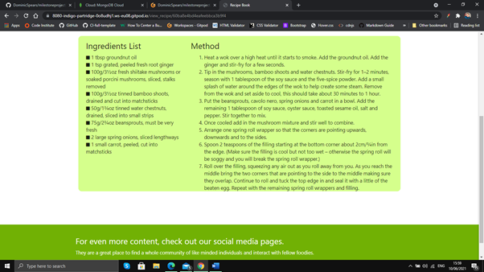

2.	As someone new to cooking, I want a method that is easy to read and concise, with each step being easy to follow along with. 
  * To address this, on the view recipe page, I added an ordered list of all seps in the method for each inividual recipe.
  * 

3.	As someone new to cooking, I want a picture of each dish to be included with its recipe, so that I can see the completed dish before cooking.
  * To address this I have added an image of each recipe to the recipe card and on the view recpe page.
  * 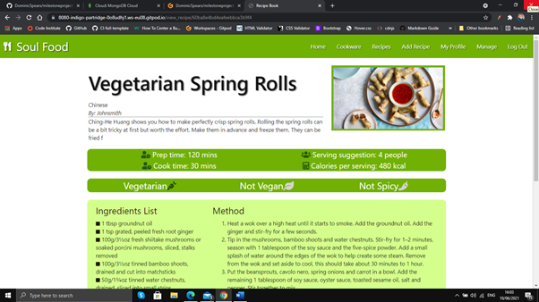

4.	As someone new to cooking, I want to know vital information about each recipe such as prep time, cook time and serving suggestions.
  * To address this I have added a table of vital information to the view recipe page, including prep time, cook time and serving suggestions.
  * 

#### Not cooking, looking for cookware range:
1.	As someone researching cookware specifically, I want a page dedicated to only cookware, without any recipes present.
  * To address this included a page for cookware only, with all items in the cookware range displayed in cards.
  * 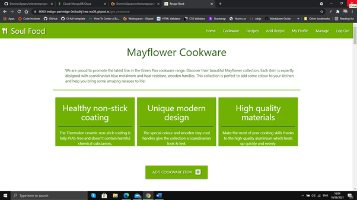

2.	As someone researching cookware specifically, I want clear images of each piece of cookware.
  * To address this I added an image of the cookware item to the top of each card.
  * 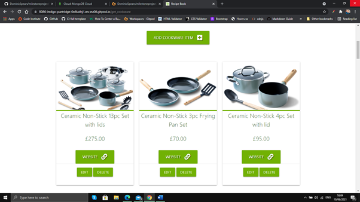

3.	As someone researching cookware specifically, I want there to be links to a store at which I can purchase the desired cookware.
  * To address this I added a link to the specific site for the cookware item, where they can be ordered if needed. 
  * 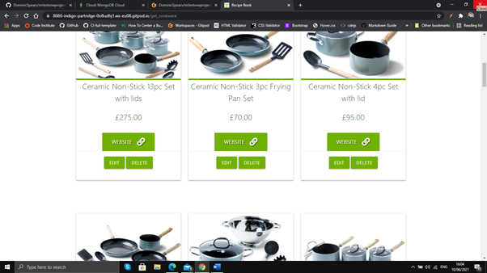

4.	As someone researching cookware specifically, want to know the benefits to the cookware range as a whole e.g. health benefits, materials used.
  * To address this I added some general benefit information to the top of the page, under the cookware line introduction. 
  * 

#### Site administrator
1. As a site administrator, I want the ability to edit and delete all recipes, even if I didn't write them myself.
  * To address this I added code that shows all recipes on the profile admin page, rather than just the recipes created by that user.
  * 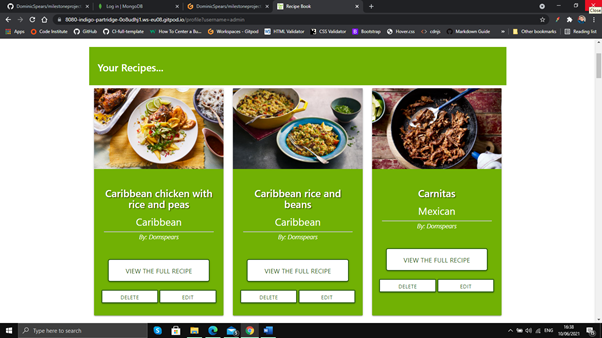

2. As a site administrator, I want the ability to add, edit and delete cuisines that users can choose to describe their recipes. 
  * To address this I created a dedicated cuisines page connected to the database, where admins can add, edit and delete cuisines.
  * 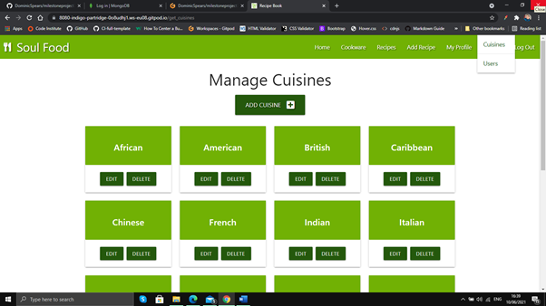

3. As a site administrator, I want the ability to edit and delete users and complete general site maintenance. 
  * To address this I created a dedicated users page connected to the database, where admins can edit and delete users.
  * 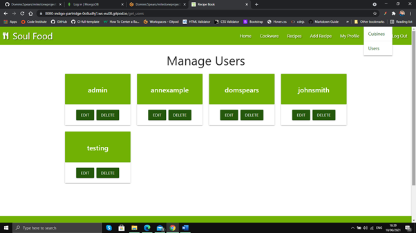

4. As a site administrator, I want to promote the cookware that our site is partnered with.   
  * To address this created a dedicated cookware page and a cookware card to the homepage, linked to said cookware page. 
  * 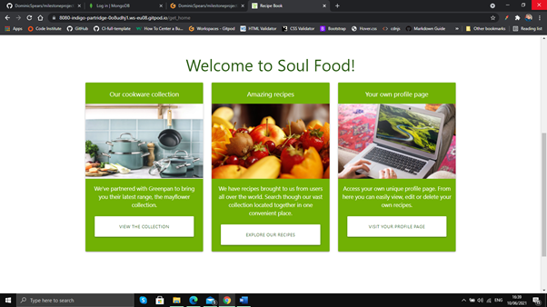
